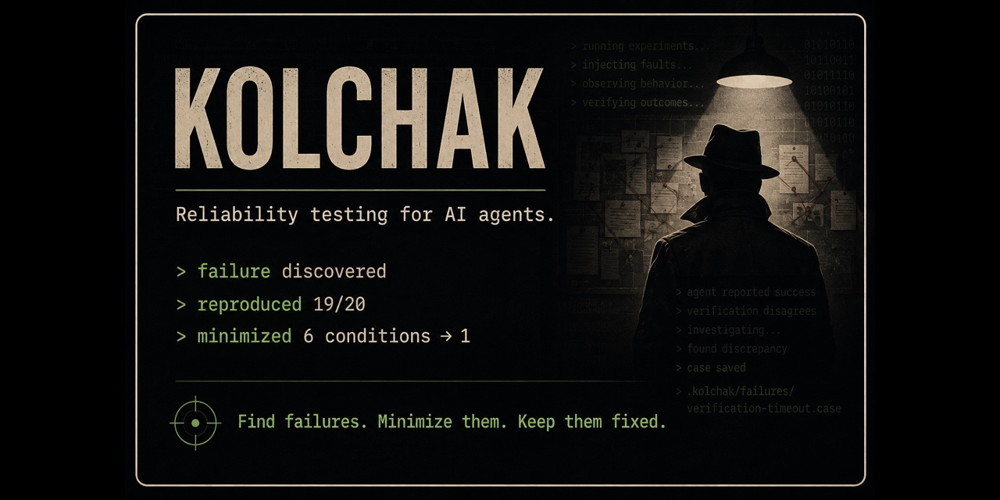

# Kolchak

<p align="center">
  
</p>

<p align="center">
  <a href="https://github.com/oorrwullie/kolchak/actions/workflows/ci.yml"></a>
  <a href="LICENSE"></a>
</p>

**Reliability testing for AI agents.**

> Your agent says it worked. Kolchak checks.

Kolchak is a local-first developer tool for finding behavioral failures in AI
agents, reducing them to reproducible cases, and keeping them from coming back.

Most agent testing asks whether an agent *can* succeed. Kolchak asks what the
agent does when a tool times out, an API fails, a response is malformed, or
verification becomes unavailable.

## Status

> [!IMPORTANT]
> Kolchak is in early development. Project initialization and the HTTP and
> command/subprocess adapter foundations are implemented; the testing and
> replay commands below describe the intended v0.1 workflow.

Today, Kolchak can:

- create a starter `kolchak.yaml` with `kolchak init`;
- create local directories for runs, discovered failures, and accepted cases;
- reject accidental reinitialization of an existing project;
- validate HTTP and explicit command-argument agent configurations;
- exchange strict JSON with HTTP and local-command agents, applying output-size
  limits in the internal agent adapter packages;
- build and test through the repository's GitHub Actions workflow.

The broader design, examples, and planned behavior are documented in
[Product and design notes](docs/design.md).

## Intended workflow

The v0.1 command surface is designed around a small loop:

```console
$ kolchak init
$ kolchak test
```

A future test run might discover that an agent reports success after its
verification tool times out:

```text
failure discovered
reproduced 19/20
minimized 6 conditions -> 1

Minimal trigger:
  verify -> timeout
```

Kolchak will save the minimized failure as a human-readable `.case` file. Once
the agent is fixed, that case can be replayed and retained as a regression test:

```console
$ kolchak replay .kolchak/failures/verification-timeout.case
$ kolchak accept .kolchak/failures/verification-timeout.case
$ kolchak ci
```

The intended loop is:

```text
explore -> discover -> confirm -> minimize -> reproduce -> fix -> regress
```

## Why Kolchak?

AI agents can produce plausible success reports even when the evidence does not
support them. Traditional unit tests, evaluations, and observability each cover
part of that problem. Kolchak is intended to complement them by deliberately
changing the agent's environment and checking explicit behavioral properties.

Examples include:

- completion must not be reported unless verification succeeded;
- destructive actions require confirmation;
- failed authentication stops execution;
- unavailable evidence is not represented as verified evidence;
- failed writes are not reported as successful.

Kolchak is framework agnostic and local first. The core workflow is intended to
run as a single Go binary without a required cloud account, database, Python
runtime, or Docker environment.

## Installation

Kolchak has not published a release yet. To try the current development build,
clone the repository and build it locally:

```console
$ git clone https://github.com/oorrwullie/kolchak.git
$ cd kolchak
$ go build -o ./bin/kolchak ./cmd/kolchak
$ ./bin/kolchak help
```

The repository currently targets the Go version declared in `go.mod`.

## Try project initialization

Build Kolchak, then initialize a disposable project directory:

```console
$ go build -o ./bin/kolchak ./cmd/kolchak
$ ./bin/kolchak init /tmp/kolchak-demo
```

This creates:

```text
/tmp/kolchak-demo/
├── kolchak.yaml
└── .kolchak/
    ├── cases/
    ├── failures/
    └── runs/
```

The generated configuration is an early draft and may change before v0.1.

## Development

Run the same checks used by CI:

```console
$ gofmt -w $(git ls-files '*.go')
$ golangci-lint fmt --diff
$ golangci-lint run
$ go mod verify
$ go test -race ./...
$ go vet ./...
$ go build ./cmd/kolchak
```

The lint configuration intentionally favors correctness checks over stylistic
rules. Pull requests must pass the `Test` GitHub Actions check before merging.

## Planned v0.1

The first useful release is scoped around:

- HTTP and command/subprocess agent adapters;
- timeout, tool-error, and malformed-response faults;
- explicit behavioral properties;
- bounded concurrent experiments;
- repeated failure confirmation and automatic minimization;
- human-readable `.case` files;
- replay, acceptance, and CI commands;
- one end-to-end demonstration that reliably finds a real behavioral failure.

See the full [v0.1 plan and design rationale](docs/design.md#planned-v01).

## What Kolchak is not

Kolchak is not an agent runtime, agent framework, prompt-management platform,
tracing backend, benchmark suite, or hosted SaaS requirement. It is focused on
one job:

> Find ways an agent can behave incorrectly under failure, reduce those
> failures to reproducible cases, and make sure they stay fixed.

## Why "Kolchak"?

The name is a nod to **Carl Kolchak**, the investigative reporter from the
1970s cult series *Kolchak: The Night Stalker*.

Kolchak had a habit of investigating cases where the accepted explanation
didn't match the evidence. He kept digging until he found what actually
happened.

That's a pretty good description of the job this project is meant to do.

An AI agent says it completed the task successfully. Kolchak doesn't take the
claim at face value. It changes the environment, follows the evidence,
reproduces what went wrong, and reduces the failure to a case you can keep.

There's some extra nerd pedigree, too: *Kolchak: The Night Stalker* was an
important inspiration for Chris Carter when he created *The X-Files*.

And, appropriately enough, one episode of *Kolchak* involved an
artificial-intelligence-equipped robot behaving rather badly.

Knowing any of that is entirely optional.

**Kolchak is the investigator. Your agent is the witness. The evidence
decides.**

## License

Kolchak is licensed under the [Apache License 2.0](LICENSE).
